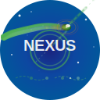
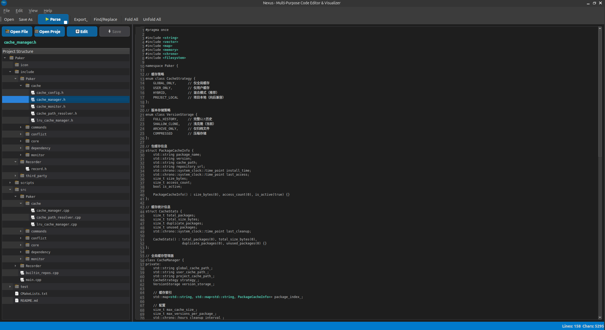

# Nexus - Multi-format Code Editor & Visualizer

<div align="center">



</div>

[](https://isocpp.org/)
[](https://www.python.org/)
[](https://golang.org/)
[](https://www.qt.io/)
[](https://cmake.org/)
[](LICENSE)
[](https://github.com/frames/Nexus)
[](https://github.com/frames/Nexus)

A Qt-based multi-format code editor, parser and visualizer with a VSCode-like interface, supporting XML, Markdown, C++, Python, and Go files. Built with C++17, Qt5, and CMake.

## ✨ Features

### Core Functionality
- **Multi-format Code Editor**: Support for XML, Markdown, C++, Python, and Go files with syntax highlighting
- **Real-time XML Structure Visualization**: Parse XML files and display their hierarchical structure in a tree view
- **Markdown Preview**: Live preview of Markdown content
- **C++ Function Analysis**: Parse C++ files to extract function definitions, parameters, and return types
- **Python Function Analysis**: Parse Python files to extract function definitions, classes, decorators, and type annotations
- **Go Function Analysis**: Parse Go files to extract function definitions, methods, structs, interfaces, and package information

### Advanced Features
- **Function Relationship Visualization**: Generate interactive graphs showing function calls and dependencies
- **Multiple Layout Algorithms**: Hierarchical, circular, and force-directed graph layouts
- **Search and Replace**: Advanced search functionality with regex support and multi-scope search
- **Code Folding**: Structure folding with visual indicators and keyboard shortcuts
- **Multi-format Serialization**: Support for XML, JSON, YAML, and CSV serialization/deserialization

### User Interface
- **VSCode-like Interface**: Dark theme with green accents
- **Interactive Function Graph**: Click on function nodes to view detailed information for C++, Python, and Go
- **Node Details Display**: Click on any node to see detailed information including attributes, path, and depth (XML)
- **Context-aware Interface**: UI adapts based on file type (XML, Markdown, C++, Python, Go)
- **File Operations**: Open, parse, edit, and save files
- **Format Conversion**: Convert between different data formats (XML ↔ JSON, XML ↔ YAML, etc.)

### Development Tools
- **Comprehensive Testing**: Full unit test coverage using Google Test
- **Automated Build System**: Python-based build and test automation scripts

## Screenshots

### Main Interface Demo



*Nexus - Multi-Purpose Code Editor & Visualizer in action*

The application features a modern, VSCode-like interface with:
- **Left Panel**: File browser and project structure tree view
- **Center Panel**: Code editor with syntax highlighting and line numbers
- **Right Panel**: Analysis results and function graph visualization (shown when parsing code)
- **Status Bar**: Real-time line count and character count statistics

### Key Features Shown:
- **Project Structure Browser**: Navigate through project files and folders
- **Syntax Highlighting**: Full support for C++, Python, Go, XML, and Markdown
- **Line Numbers**: VSCode-style line numbering for better code navigation
- **File Operations**: Open files, edit content, and save changes
- **Code Analysis**: Parse and visualize code structure and function relationships

## 🛠️ Tech Stack


## 📋 Requirements

- **C++17** compatible compiler (GCC 7+, Clang 5+, MSVC 2017+)
- **Qt5** (Core, Widgets)
- **CMake** 3.16+
- **Google Test** for unit testing

## 🚀 Building

### 📦 Prerequisites

Install the required dependencies:

**Ubuntu/Debian:**
```bash
sudo apt update
sudo apt install build-essential cmake qt5-default libgtest-dev
```

**CentOS/RHEL/Fedora:**
```bash
sudo yum install gcc-c++ cmake qt5-devel gtest-devel
# or for Fedora:
sudo dnf install gcc-c++ cmake qt5-devel gtest-devel
```

**macOS:**
```bash
brew install cmake qt5 gtest
```

**Or use our automated script:**
```bash
python3 ./scripts/install_dependencies.py
```

### 🔨 Build Instructions

1. **Clone the repository:**
```bash
git clone <repository-url>
cd Nexus
```

2. **Create build directory:**
```bash
mkdir build
cd build
```

3. **Configure with CMake:**
```bash
cmake ..
```

4. **Build the project:**
```bash
make -j$(nproc)
```

5. **Run tests:**
```bash
make test
# or run tests directly:
./bin/Nexus_tests
```

6. **Run the application:**
```bash
./bin/Nexus
```

**Or use our automated build script:**
```bash
python3 scripts/build.py
```

**Run tests with:**
```bash
python3 scripts/run_tests.py
```

## 🎯 Usage

### General Operations
1. **Open a file**: Click "Open File" or use File → Open
2. **Edit content**: Use the built-in editor with syntax highlighting
3. **Search and replace**: Use Ctrl+F to find and replace text
4. **Code folding**: Use Ctrl+Shift+[ to fold all, Ctrl+Shift+] to unfold all
5. **Save modifications**: Use File → Save As

### XML Files
1. **Parse XML**: Click "Parse XML" to generate the visual structure
2. **Explore the structure**: Click on nodes in the tree view to see details

### Markdown Files
1. **Live preview**: Preview updates automatically as you edit
2. **Syntax highlighting**: Full Markdown syntax support

### C++ Files
1. **Parse C++**: Click "Parse C++" to analyze function definitions and relationships
2. **Generate function graph**: Click "Generate Function Graph" to visualize function calls
3. **Interactive exploration**: Click on function nodes to view detailed information
4. **Multiple layouts**: Choose between hierarchical, circular, and force-directed layouts

### Python Files
1. **Parse Python**: Click "Parse Python" to analyze function definitions, classes, and decorators
2. **Generate function graph**: Click "Generate Function Graph" to visualize function calls and class relationships
3. **Interactive exploration**: Click on function nodes to view detailed information including type annotations
4. **Advanced parsing**: Support for async functions, class methods, static methods, and property decorators

### Go Files
1. **Parse Go**: Click "Parse Go" to analyze function definitions, methods, structs, and interfaces
2. **Generate function graph**: Click "Generate Function Graph" to visualize function calls and method relationships
3. **Interactive exploration**: Click on function nodes to view detailed information including receiver types and return values
4. **Advanced parsing**: Support for methods with receivers, multiple return values, variadic parameters, and exported/unexported functions

## 📁 Project Structure

```
Nexus/
├── CMakeLists.txt
├── include/
│   ├── ui/
│   │   ├── main_window.h
│   │   ├── search_dialog.h
│   │   ├── code_folding.h
│   │   └── function_graph_view.h
│   ├── core/
│   │   ├── xml_node.h
│   │   ├── xml_parser.h
│   │   ├── xml_serializer.h
│   │   ├── cpp_parser.h
│   │   ├── python_parser.h
│   │   └── go_parser.h
│   ├── syntax/
│   │   ├── xml_highlighter.h
│   │   ├── markdown_highlighter.h
│   │   ├── cpp_highlighter.h
│   │   ├── python_highlighter.h
│   │   └── go_highlighter.h
│   └── features/
│       └── (reserved for feature modules)
├── src/
│   ├── app/
│   │   └── main.cpp
│   ├── ui/
│   │   ├── main_window.cpp
│   │   ├── search_dialog.cpp
│   │   ├── code_folding.cpp
│   │   └── function_graph_view.cpp
│   ├── core/
│   │   ├── xml_node.cpp
│   │   ├── xml_parser.cpp
│   │   ├── xml_serializer.cpp
│   │   ├── cpp_parser.cpp
│   │   ├── python_parser.cpp
│   │   └── go_parser.cpp
│   └── syntax/
│       ├── xml_highlighter.cpp
│       ├── markdown_highlighter.cpp
│       ├── cpp_highlighter.cpp
│       ├── python_highlighter.cpp
│       └── go_highlighter.cpp
├── test/
│   ├── main.cpp
│   ├── xml_parser_test.cpp
│   ├── xml_serializer_test.cpp
│   ├── search_test.cpp
│   └── code_folding_test.cpp
├── scripts/
│   ├── build.py
│   ├── install_dependencies.py
│   └── run_tests.py
└── examples/
    ├── sample.xml
    ├── simple.xml
    ├── sample.cpp
    ├── sample.py
    └── sample.go
```


## 🧪 Testing

The project includes comprehensive unit tests covering:

### XML Functionality
- XML parsing functionality
- Node creation and manipulation
- Attribute handling
- Nested element parsing
- Error handling
- XML entity escaping

### C++ Functionality
- C++ function parsing and analysis
- Function parameter extraction
- Function call relationship detection
- Class definition parsing

### Python Functionality
- Python function and class parsing
- Type annotation extraction
- Decorator detection and analysis
- Async function support
- Class inheritance analysis

### Go Functionality
- Go function and method parsing
- Struct and interface analysis
- Package declaration extraction
- Method receiver type detection
- Multiple return value support
- Variadic parameter handling

### UI Components
- Search and replace functionality
- Code folding operations
- Function graph visualization

Run tests with:
```bash
cd build
make test
```

## 🤝 Contributing

1. Fork the repository
2. Create a feature branch
3. Make your changes
4. Add tests for new functionality
5. Ensure all tests pass
6. Submit a pull request

## 📄 License

This project is licensed under the MIT License - see the [LICENSE](LICENSE) file for details.

## 🆕 What's New

### Programming Language Support (Latest Update)
- **C++ Syntax Highlighting**: Full support for C++17 syntax with VSCode-like colors
- **Python Syntax Highlighting**: Complete Python syntax support including f-strings, decorators, and type annotations
- **Go Syntax Highlighting**: Comprehensive Go syntax support including interfaces, channels, goroutines, and build tags
- **Function Analysis**: Automatic parsing of function definitions, parameters, and return types for C++, Python, and Go
- **Class/Struct Structure Analysis**: Detection of class definitions (C++/Python), structs and interfaces (Go)
- **Advanced Language Features**: 
  - Python: async functions, decorators, type annotations
  - Go: methods with receivers, multiple return values, variadic parameters
- **Function Call Visualization**: Interactive graph showing function dependencies and call relationships
- **Multiple Layout Algorithms**: Choose between hierarchical, circular, and force-directed layouts
- **Interactive Exploration**: Click on function nodes to view detailed information

### Enhanced User Experience
- **Multi-format Editor**: Seamless switching between XML, Markdown, C++, Python, and Go files
- **Context-aware Interface**: UI adapts based on file type for optimal workflow
- **Real-time Analysis**: Instant parsing and visualization of C++, Python, and Go code structure
- **Cross-language Support**: Unified function graph visualization for C++, Python, and Go
- **VSCode-like Interface**: Modern, clean design with line numbers and syntax highlighting
- **Project Browser**: Open entire project folders and navigate through file structures
- **Real-time Statistics**: Live line count and character count in status bar
- **Optimized Layout**: Streamlined two-panel design with on-demand analysis panels

## 🙏 Acknowledgments

- Built with Qt5 for the user interface
- Uses Google Test for unit testing
- Inspired by Visual Studio Code's interface design
- C++, Python, and Go parsing capabilities powered by custom regex-based analysis engines
- Multi-language syntax highlighting with modern language feature support:
  - Python 3.6+ features (f-strings, type annotations, async/await)
  - Go 1.16+ features (interfaces, channels, embedded structs)
  - C++17 features (auto, lambdas, structured bindings) 